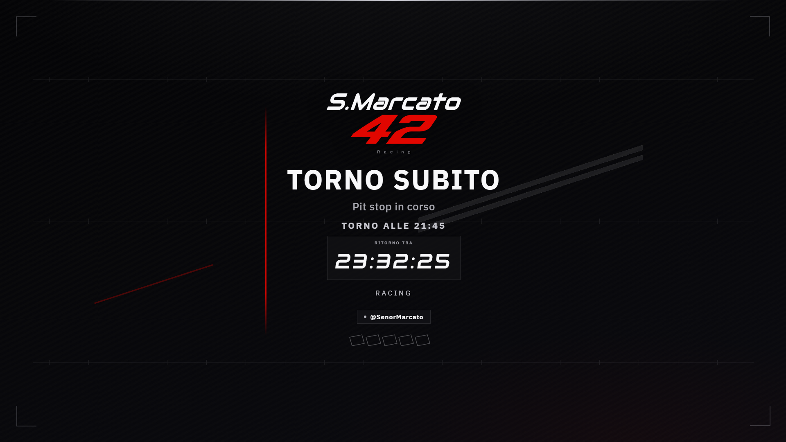
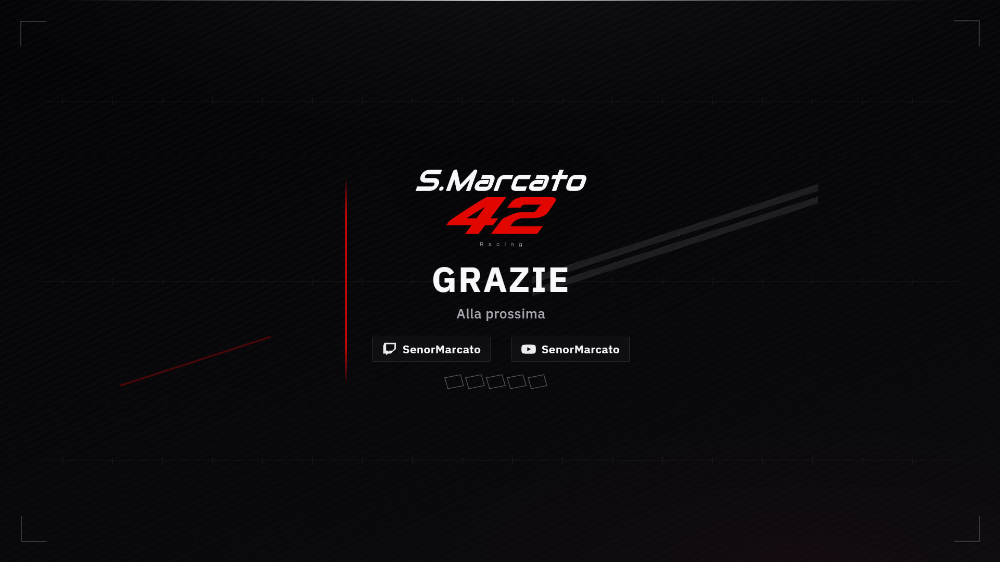
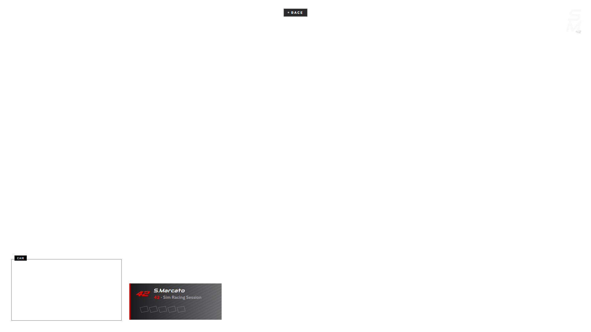

# OBS Sim Racing Pack

Pacchetto **OBS Studio** per streaming sim racing a **1920×1080**, pensato per setup a **triplo monitor** (+ eventuale monitor singolo), webcam e overlay HTML brandizzati.

Due profili nello stesso repo:

| Profilo | Brand | Overlay | Collezioni OBS |
|---------|--------|---------|----------------|
| **PiGreco Racing** | Team `#00C400` / `#009FE5` | `overlays/` | `obs/PiGreco_Racing.json` |
| **S.Marcato 42** | Personale carbon / ice / Rosso Corsa | `overlays-marcato/` | `obs/S_Marcato_42.json`, `obs/S_Marcato_Replay.json`, `obs/S_Marcato_Rec_2K.json` |

> Non-technical? Apri **`LEGGIMI.txt`** oppure fai doppio clic su **`Setup.bat`**.

---

## Showcase

Anteprime **1920×1080** (gallery locale: [`showcase/index.html`](showcase/index.html)).

### S.Marcato 42

| Starting Soon | Live Triplo |
|:---:|:---:|
|  |  |

| BRB | Ending |
|:---:|:---:|
|  |  |

<p align="center">
  
  <br />
  <sub>Live Chrome (lower-third + CAM)</sub>
</p>

### PiGreco Racing

| Starting Soon | Live |
|:---:|:---:|
|  |  |

| BRB | Ending |
|:---:|:---:|
|  |  |

Rigenera gli screenshot:

```powershell
python tools/generate_showcase.py
```

---

## Cosa include

- Scene ready: **Starting Soon**, **Live**, **BRB**, **Ending**, più layout **Rec** (registrazione pulita) e pack **Replay**
- Overlay Browser Source (HTML/CSS/JS) — niente grafica “baked” in OBS
- Acquisizione **Game Capture** iRacing + **Display Capture** per i monitor
- **StreamCam** in PIP / riquadro CAM
- Musiche interstiziali **sintetizzate in locale** (niente Content ID Twitch tipico delle librerie royalty-free)
- Transizioni **Move** + stinger brand
- Setup guidato Windows (`Setup.bat` / `Setup.ps1`) e pannello config in OBS

Canvas target: **1920×1080** @ 60 fps (OBS 32.x, transform relativi `pos_rel` / `scale_rel`).

---

## Avvio rapido (Windows)

### 1. Setup streamer

```text
doppio clic → Setup.bat
```

Ti chiede nick / nome pilota, installa Python se manca (UAC), personalizza gli overlay e copia la collezione in:

`%APPDATA%\obs-studio\basic\scenes\`

### 2. Apri OBS

**Scene Collection** → scegli:

- **PiGreco Racing** — stream team
- **S.Marcato 42** — gara live personale
- **S.Marcato Replay** — commento / stream di un replay iRacing

### 3. Pannello config (opzionale ma comodo)

All’apertura di OBS lo script Lua `obs/scripts/pigreco_config_autostart.lua` avvia da solo il server su `http://127.0.0.1:8766/` (non richiede Python Settings in OBS). Opzionale: `tools/install_config_autostart.ps1` lo tiene caldo anche a login Windows.

1. **Visualizza → Docks → Custom Browser Docks** (se manca):
   - PiGreco: `http://127.0.0.1:8766/`
   - Marcato: `http://127.0.0.1:8766/?profile=marcato`
2. Emergenza / primo avvio: doppio clic su `Start-ConfigPanel.bat` (poi puoi chiudere la finestra)
3. Telecronaca (opzionale): `Start-Telemetry.bat mock` oppure `iracing` — vedi [`docs/TELEMETRY_BROADCAST.md`](docs/TELEMETRY_BROADCAST.md)

Dettagli: [`docs/OBS_CONFIG_PANEL.md`](docs/OBS_CONFIG_PANEL.md)

### 4. Dopo ogni modifica overlay

Browser Source → **Refresh cache of current page** (o riavvia OBS).

> Chiudi OBS prima di riscrivere i JSON in `obs/`, altrimenti alla chiusura può sovrascrivere i file.

---

## Scene — S.Marcato 42 (live)

| Scena | Uso |
|-------|-----|
| Starting Soon | Countdown / teaser + music bed |
| Live Race | Monitor centro + chrome + cam |
| Live Singolo | Monitor singolo + chrome + cam |
| Live Triplo | Finestra iRacing + bande brand + cam |
| Rec Singolo / Rec Triplo | Solo gameplay (registrazione clean) |
| Rec \* Live | Alias stream (stesso layout delle Live) |
| BRB / Ending | Pausa e chiusura |

Guida: [`docs/S_MARCATO_42.md`](docs/S_MARCATO_42.md)

## Scene — S.Marcato Replay

Solo pack replay (niente Live Race/Singolo/Triplo):

| Scena | Uso |
|-------|-----|
| Replay iRacing | Game Capture + badge REPLAY + **Cam PIP** (webcam + riquadro CAM, eye on/off) |
| Replay Monitor | Monitor centrale + REPLAY + Cam PIP |
| Rec Singolo / Rec Triplo | Registrazione clean |
| Rec \* Live | Stream commentato (+ Cam PIP / slot CAM su Triplo) |
| BRB / Ending | Pausa e chiusura |

Guida breve: [`replays/LEGGIMI.txt`](replays/LEGGIMI.txt)

### Telecronaca (classifica / focus / flag)

Overlay **Overlay Broadcast Chrome** sulle scene Replay / Rec * Live (occhio off di default).
Bridge locale iRacing o mock → `ws://127.0.0.1:8765`. Guida: [`docs/TELEMETRY_BROADCAST.md`](docs/TELEMETRY_BROADCAST.md)

## Registrazione 2K (2560×1440)

Per VOD nativi (senza downscale a 1080):

1. **Profilo OBS** → `Rec 2K` (canvas/output 2560×1440)
2. **Collezione** → `S.Marcato Rec 2K`
3. Scene: `Rec Singolo Live` / `Rec Triplo Live` (con grafiche + cam), oppure Rec clean senza overlay
4. Cam opzionale: occhio su **StreamCam** — con cam off il lower-third torna in basso a sinistra
5. Encoder: **NVENC HEVC VBR 25 Mbps** (max 40) — ~3–5 GB / 17 min a 1440p60, non H.264 CQP
6. Per lo stream resta il profilo 1080 + collezioni Live/Replay

Profilo template: `obs/profiles/Rec_2K/` · ADR: [`docs/adr/007-recording-1440p.md`](docs/adr/007-recording-1440p.md)

## Scene — PiGreco Racing

Starting Soon · Live Race · Live Singolo · Rec… · BRB · Ending  
Guida PDF: [`Guida_PiGreco_OBS.pdf`](Guida_PiGreco_OBS.pdf)  
Showcase: [`showcase/`](showcase/)

---

## Config streamer

### PiGreco — `overlays/config.js` (o pannello)

| Chiave | Uso |
|--------|-----|
| `username` / `pilotName` / `twitchHandle` | Identità |
| `teamName` / `eventTitle` / `tagline` | Brand e sessione |
| `sponsors` / `sponsorsEnabled` | Rotator partner |

### Marcato — `overlays-marcato/config.values.json`

Stesse idee, senza sponsor team. Brand kit: carbon `#08080A`, ice, accent **Rosso Corsa** `#E10600`, abstract system (weave / stripes −18°).

Override al volo via query string, es.:

```text
live-chrome.html?eventTitle=Night%20Race
triple-frame.html?cam=1&badge=LIVE
```

---

## Struttura repo

```text
Setup.bat / Setup.ps1     Setup guidato
LEGGIMI.txt               Promemoria rapido
obs/                      Collezioni scene JSON
overlays/                 Pack PiGreco
overlays-marcato/         Pack S.Marcato 42
audio/interstitials/      Music beds (generati)
replays/                  Note + slot race-replay.mp4
tools/                    Generatori e setup
docs/                     Architettura, roadmap, guide
adapters/                 StreamElements / engagement
showcase/                 Anteprime PNG
tests/                    Pytest
```

---

## Tool per sviluppatori / agent

```powershell
# Rigenera collezioni OBS (chiudi OBS prima)
python tools/generate_pack.py --profile pigreco
python tools/generate_pack.py --profile marcato

# Music beds originali (anti Content ID)
python tools/generate_interstitial_music.py

# Showcase / guida PDF
python tools/generate_showcase.py
python tools/generate_pdf_guide.py

# Test
python -m pytest -q
```

Documentazione agent: [`AGENTS.md`](AGENTS.md) · strategia: [`STRATEGY.md`](STRATEGY.md) · roadmap: [`docs/ROADMAP.md`](docs/ROADMAP.md)

---

## Hardware / acquisizione tipica

- Triplo monitor **separati** (non Surround): in live classica si usa spesso il **centro**; **Live Triplo** acquisisce la **finestra iRacing** (span triplo se attivo in-game)
- Webcam: Logitech StreamCam (ID già cablato nel pack — modifica se cambi device)
- Streaming multi-piattaforma: Restream / plugin multistream (fuori da questo repo)

---

## Licenze e attribution

- Brand **PiGreco Racing**: vedi [`ATTRIBUTION.md`](ATTRIBUTION.md)
- Brand **S.Marcato 42**: asset personali del pilota (kit in `overlays-marcato/assets/brand/`)
- Music beds: sintetizzati da `tools/generate_interstitial_music.py` — originali del pack

**Non committare** stream key, token OAuth, JWT StreamElements o secret URL.

---

## Hotkey consigliate (esempio)

| Tasto | Scena |
|-------|--------|
| F1 | Starting Soon |
| F2 | Live Race / Replay iRacing |
| F3 | Live Singolo / Live Triplo |
| F4 | BRB |
| F5 | Ending |

---

## Supporto

Issue e PR su questo repository. Per setup team non tecnico resta valido il percorso **`Setup.bat` → OBS → Refresh overlay**.
