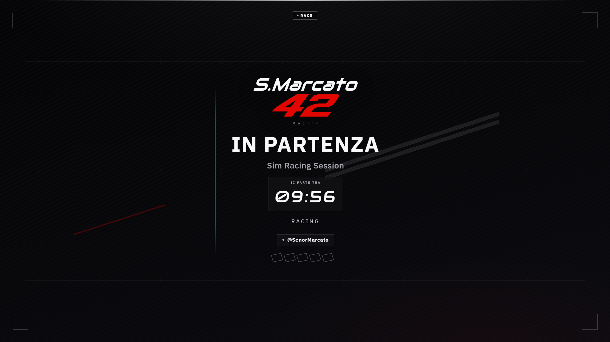
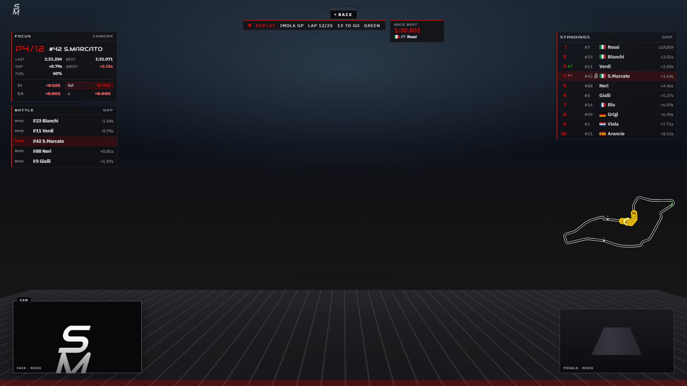
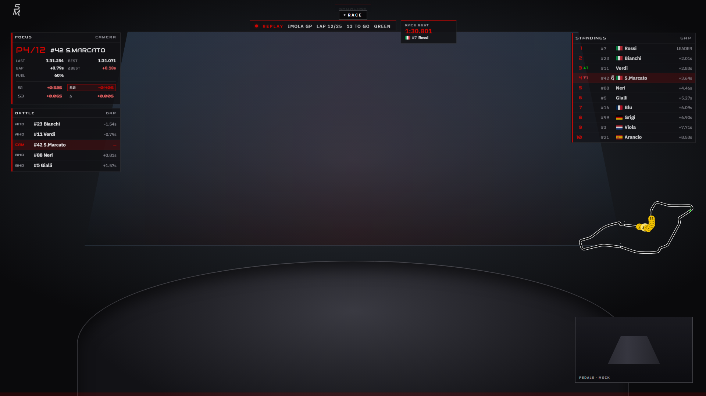
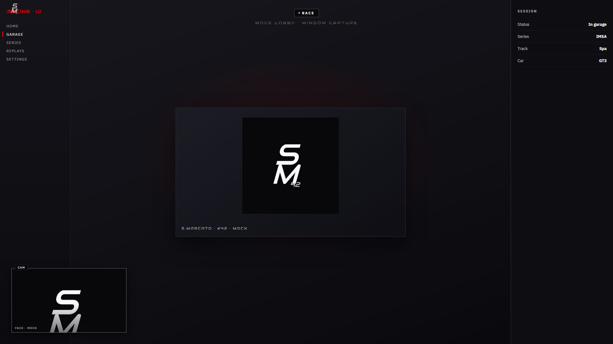
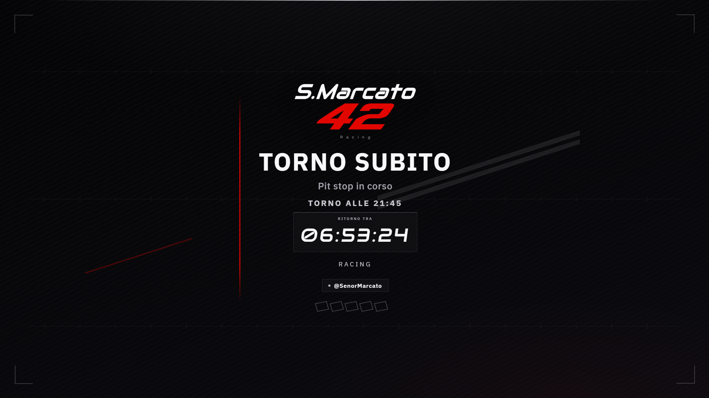
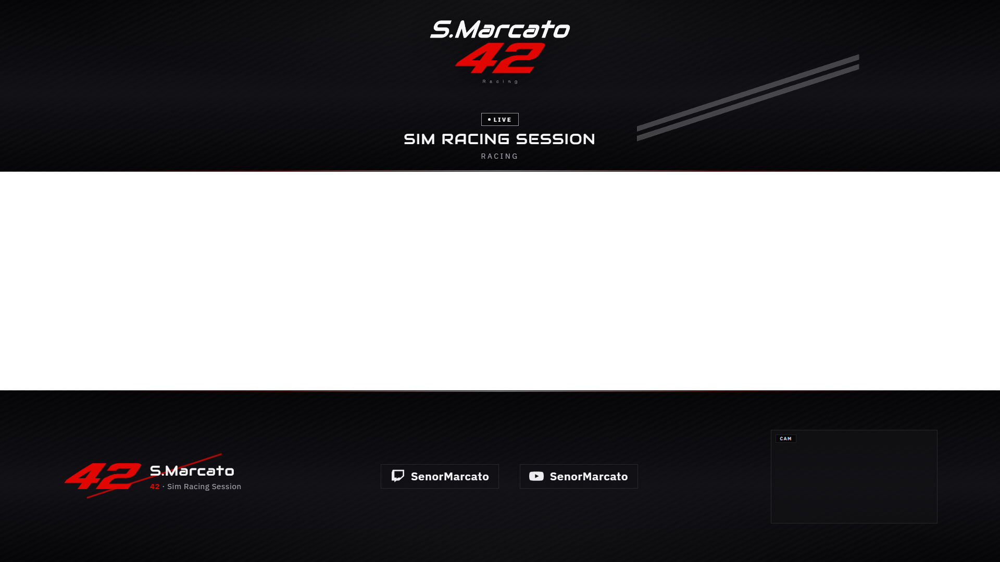
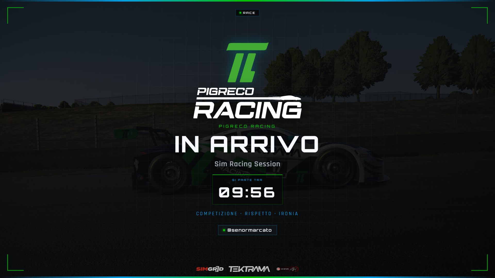
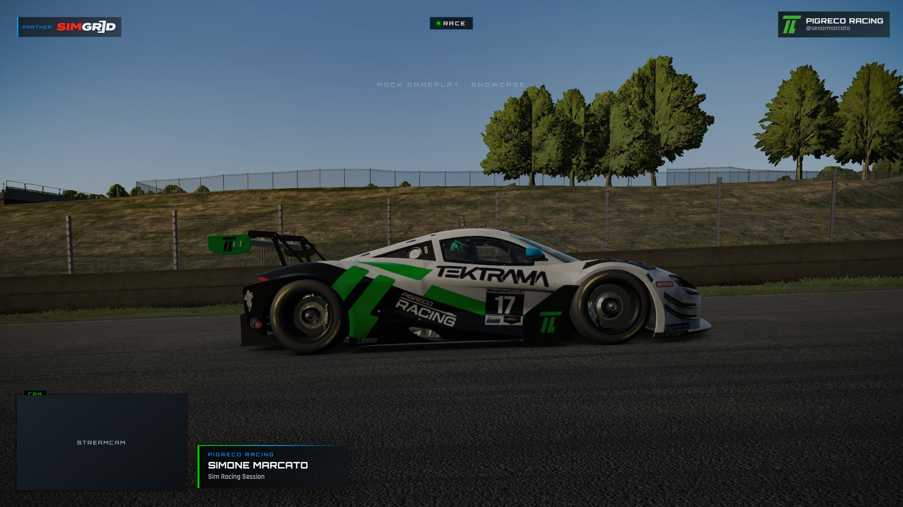
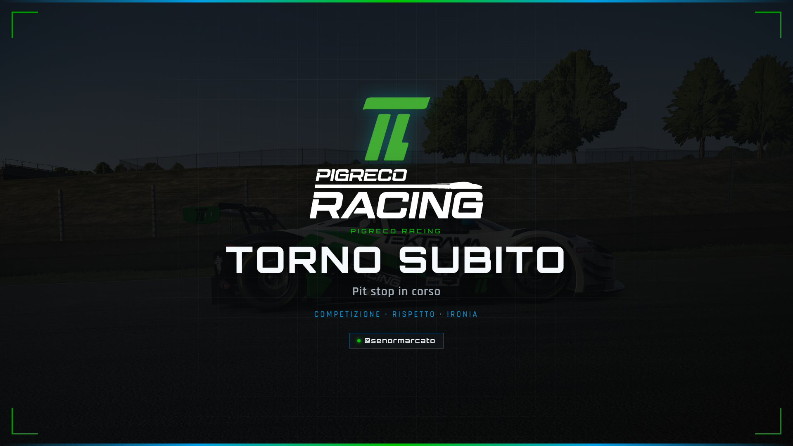
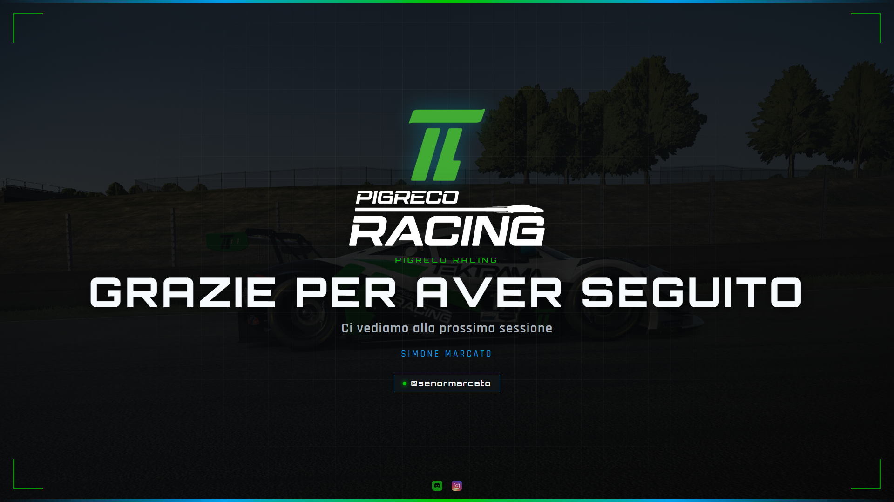

# OBS PiGreco Racing

**Production-ready OBS Studio pack for sim racing streams** — brand-coherent chrome, local HTML overlays, hands-free **Live ↔ Lobby ↔ Headcam**, and a double-click Windows setup. One repo, two looks: team **PiGreco Racing** and personal **S.Marcato 42**.


> **Pilota non tecnico?** Apri [`LEGGIMI.txt`](LEGGIMI.txt), fai doppio clic su **`Setup.bat`**, oppure incolla il [one-liner](#quick-start-windows) in PowerShell — guida e setup in italiano.

Zip → useful OBS preview in under **10 minutes**. Gameplay stays center-stage; sponsors and telemetry stay peripheral. Open OBS → Session Director + telemetry start themselves. No SaaS, no mandatory cloud — files on disk you can share in Discord.

---

## Showcase

Full-bleed **1920×1080** previews — browse locally: [`showcase/index.html`](showcase/index.html).

### S.Marcato 42

| Starting Soon | Live |
|:---:|:---:|
|  |  |

| Headcam | Lobby |
|:---:|:---:|
|  |  |

| BRB | Ending |
|:---:|:---:|
|  |  |

<p align="center">
  
  <br />
  <sub>Triple-frame (Replay / Rec). Live/Headcam previews include mock telecronaca + cams.</sub>
</p>

### PiGreco Racing

| Starting Soon | Live |
|:---:|:---:|
|  |  |

| BRB | Ending |
|:---:|:---:|
|  |  |

```powershell
python tools/generate_showcase.py
```

---

## Why this pack

- **Setup.bat** — nick Twitch, scelta pack OBS (default **solo PiGreco**), installa Python/OBS/dipendenze se mancano, personalizza overlay, copia collezione in AppData
- **Hands-free Session Director** — iRacing open + telem → **Live** / **Headcam**; UI-only or quit → **Lobby**; reopen restores the race scene you left
- **Brand chrome that respects the FOV** — π / 42 identity in corners; center stays gameplay
- **Browser Source overlays** — HTML/CSS/JS, not baked OBS images; refresh when you change config
- **Multi-cam race look** — face PiP (NVIDIA VB), Headcam (Brio), pedals crop — on Live / Headcam
- **Original interstitial music** — Pixabay beds on Starting Soon / Lobby / BRB / Ending
- **Optional sim-pro stack** — iRacing telecronaca, track map, flag FX — all local WebSocket / HTTP

Canvas target: **1920×1080** @ 60 fps (OBS 32.x, relative transforms `pos_rel` / `scale_rel`).

---

## Two profiles

| Profile | Brand | Overlays | OBS collections |
|---------|--------|----------|-----------------|
| **PiGreco Racing** | Team `#00C400` / `#009FE5` | `overlays/` | `obs/PiGreco_Racing.json` |
| **S.Marcato 42** | Carbon / ice / Rosso Corsa `#E10600` | `overlays-marcato/` | `obs/S_Marcato_42.json`, `obs/S_Marcato_Replay.json`, `obs/S_Marcato_Rec_2K.json` |

Switch collections in OBS — no uninstall needed.

---

## Features

| Area | What you get | Docs |
|------|----------------|------|
| Broadcast polish | Countdown, session badge, BRB timer, rich ending + QR | [`docs/`](docs/README.md) |
| Stinger & cams | Brand stinger, Cam PIP / Headcam / pedals, NV VB notes | [`STINGER`](docs/STINGER.md) · [`CAMERAS`](docs/CAMERAS.md) |
| Config dock | Live config at `http://127.0.0.1:8766/` | [`OBS_CONFIG_PANEL`](docs/OBS_CONFIG_PANEL.md) |
| **Session Director** | Auto **Live ↔ Lobby ↔ Headcam**, telem autostart, session reset tra gare, Lua on OBS open | [`SESSION_DIRECTOR`](docs/SESSION_DIRECTOR.md) |
| Telecronaca | Standings / focus / battle / flags over WebSocket `:8765` | [`TELEMETRY_BROADCAST`](docs/TELEMETRY_BROADCAST.md) |
| Track map | Peripheral minimap + self-learn / official SVG | [`TRACK_MAP`](docs/TRACK_MAP.md) |
| Flag FX | Animated rails on Live (default) — no full-screen cutaway | [`FLAG_DIRECTOR`](docs/FLAG_DIRECTOR.md) |
| Rec 2K | Native 2560×1440 VOD profile | [`ADR-007`](docs/adr/007-recording-1440p.md) |
| Engagement | StreamElements chat / alert themes · VirtualDeck | [`adapters/streamelements`](adapters/streamelements/README.md) · [`OBS_VIRTUALDECK`](docs/OBS_VIRTUALDECK.md) |

Also included: Game Capture (iRacing) + Lobby window capture (Chromium UI), StreamCam face PiP, Move / Dissolvenza transitions, **Replay** pack for commentary, clean **Rec** layouts.

---

## Config dock — change the stream without editing files

The pack ships an **in-OBS Custom Browser Dock** so pilots tweak identity, session, countdown, BRB, ending, sponsors, and telecronaca toggles **without opening `config.js`**.

| | |
|--|--|
| **URL** | `http://127.0.0.1:8766/` (PiGreco) · `?profile=marcato` for S.Marcato |
| **Truth file** | `overlays/config.values.json` or `overlays-marcato/config.values.json` |
| **Apply** | **Salva e applica** → regenerates `config.js` → refresh Browser Sources |

**What you can drive from the dock**

| Section | Controls |
|---------|----------|
| Identity | Username, pilot name, race number, Twitch handle, team |
| Live session | Event title, tagline, Practice / Quali / Race badge |
| Starting Soon | Message, countdown seconds or `goLiveAt` clock time |
| BRB | Message, “back at HH:MM”, optional return countdown |
| Ending | Message, Discord CTA / QR (PiGreco), follow text |
| Sponsors | Rotator on/off, timing, JSON list (PiGreco only) |
| Telecronaca | Broadcast overlay on/off, WS URL, widget toggles, director, track map |

Autostart: Lua `obs/scripts/pigreco_config_autostart.lua` when OBS opens — config dock **and** Session Director + telemetry (localhost only). Fallback: `Start-ConfigPanel.bat` / `Start-FlagDirector.bat`. Full setup: [`docs/OBS_CONFIG_PANEL.md`](docs/OBS_CONFIG_PANEL.md) · [`docs/SESSION_DIRECTOR.md`](docs/SESSION_DIRECTOR.md).

---

## Telecronaca — local telemetry on stream

Optional **sim-pro** layer for replay commentary and live races: standings, focus, relatives, session/flag strip, battle panel, moment chips, track minimap — all **on your PC**, no cloud overlay service. **Session Director** ties it to OBS scenes.

```text
iRacing SDK or mock  →  adapters/telemetry (WS :8765)
                              ↓
              Overlay Broadcast Chrome (HTTP via :8766)
                              ↓
         Session Director (OBS WebSocket) — Live/Lobby/Headcam + Flag FX
```

| Piece | Role |
|-------|------|
| **Broadcast chrome** | Peripheral HTML: classifica, relative, focus, session/flag strip, battle, ticker, director chips |
| **Track map** | Mid-right minimap (`trackMapEnabled`) |
| **Session Director** | Live ↔ Lobby ↔ Headcam from telem / iRacing process; Flag FX on Live (default) |
| **Config dock** | Master switch `telemetryEnabled` (default off — no WS until you opt in) |

**Autostart (Marcato / pack):** opening OBS runs Lua → config `:8766` + Session Director + telemetry `:8765`. Fallback: `Start-FlagDirector.bat` / `Start-Telecronaca.bat`.

**One-command smoke test (no iRacing):** `Start-Telecronaca.bat mock` — config `:8766`, telemetry `:8765`, Session Director. In OBS, eye **on** **Overlay Broadcast Chrome** (must be `http://127.0.0.1:8766/o/...`, not `file://`).

**Live / replay:** usually nothing to click — or `Start-Telecronaca.bat iracing` if Lua is disabled.

| Guide | Covers |
|-------|--------|
| [`SESSION_DIRECTOR`](docs/SESSION_DIRECTOR.md) | Live↔Lobby↔Headcam, telem autostart, checklist |
| [`TELEMETRY_BROADCAST`](docs/TELEMETRY_BROADCAST.md) | Bridge, widgets, director modes (`auto` / `manual` / `off`) |
| [`TRACK_MAP`](docs/TRACK_MAP.md) | Open + self-learn + official SVG |
| [`FLAG_DIRECTOR`](docs/FLAG_DIRECTOR.md) | Flag FX overlay (prefer Session Director doc for live) |
| [`CONTRACT`](adapters/telemetry/CONTRACT.md) | WebSocket tick / event schema |

Third-party tools (SimHub, Racing Overlay) can sit **beside** the pack as extra Browser Sources; brand chrome stays the primary layer.

---

## Quick start (Windows)

### 1. Setup

**One-liner (consigliato per il team)** — scarica `main` da GitHub ed esegue `Setup.ps1`:

```powershell
irm https://raw.githubusercontent.com/marcatos/obs-pigreco-racing/main/install.ps1 | iex
```

Da **CMD**:

```cmd
powershell -NoProfile -ExecutionPolicy Bypass -Command "irm https://raw.githubusercontent.com/marcatos/obs-pigreco-racing/main/install.ps1 | iex"
```

**Oppure** doppio clic su [`Setup.bat`](Setup.bat) se hai già la cartella (ZIP o clone).

Lo script chiede:

1. **Nick Twitch** (senza `@`)
2. **Pack OBS** — `[1]` solo **PiGreco Racing** (default, Invio) · `[2]` PiGreco + S.Marcato 42 · `[3]` solo S.Marcato
3. Conferme **UAC** se serve (Python 3.12 via winget)

Poi verifica e installa automaticamente:

| Componente | Come |
|----------|------|
| Python 3.12 | winget se assente |
| Librerie pip | [`requirements-setup.txt`](requirements-setup.txt) — Pillow, websockets, obsws-python, pyirsdk, qrcode |
| OBS Studio | winget se assente |
| Collezione scene | `%APPDATA%\obs-studio\basic\scenes\` |

Import check: `tools/verify_setup_dependencies.py`. Log setup: `logs/setup-*.log`.

Italian walkthrough: [`LEGGIMI.txt`](LEGGIMI.txt) · PDF: [`Guida_PiGreco_OBS.pdf`](Guida_PiGreco_OBS.pdf)

**Non-interactive** (es. script tuo):

```powershell
.\Setup.ps1 -Username tuo_nick -Profiles pigreco
```

### 2. Open OBS

**Scene Collection** → pick:

- **PiGreco Racing** — team stream
- **S.Marcato 42** — personal live race
- **S.Marcato Replay** — iRacing replay commentary

### 3. Config panel + Session Director (usually automatic)

On OBS open, Lua `obs/scripts/pigreco_config_autostart.lua` starts:

1. Config dock server → `http://127.0.0.1:8766/`
2. **Session Director** + iRacing telemetry → `:8765` (Live↔Lobby↔Headcam)

Optional login keepalive: `tools/install_config_autostart.ps1`.

1. **View → Docks → Custom Browser Docks**:
   - PiGreco: `http://127.0.0.1:8766/`
   - Marcato: `http://127.0.0.1:8766/?profile=marcato`
2. Fallback: `Start-ConfigPanel.bat` · `Start-FlagDirector.bat`
3. Edit fields → **Salva e applica** → refresh Browser Sources (see [Config dock](#config-dock--change-the-stream-without-editing-files))
4. Telecronaca eye **on** **Overlay Broadcast Chrome** when you want standings on stream

Deep dive: [`OBS_CONFIG_PANEL`](docs/OBS_CONFIG_PANEL.md) · [`SESSION_DIRECTOR`](docs/SESSION_DIRECTOR.md) · [`TELEMETRY_BROADCAST`](docs/TELEMETRY_BROADCAST.md)

### 4. After overlay edits

Browser Source → **Refresh cache of current page** (or restart OBS).

> Close OBS before regenerating JSON under `obs/`, or OBS may overwrite files on exit.

---

## Scenes

### S.Marcato 42 (live slim)

| Scene | Use |
|-------|-----|
| Starting Soon | Countdown / teaser + music bed |
| **Live** | Game Capture + chrome + face PiP + pedals + Flag FX |
| **Headcam** | Brio fullscreen + telecronaca + pedals (no empty CAM frame) |
| **Lobby** | iRacing UI window capture + music (sim open, no telem) |
| BRB / Ending | Pause and close |

Hands-free cuts: [`docs/SESSION_DIRECTOR.md`](docs/SESSION_DIRECTOR.md) · pack notes: [`docs/S_MARCATO_42.md`](docs/S_MARCATO_42.md)

### S.Marcato Replay

| Scene | Use |
|-------|-----|
| Replay iRacing / Monitor | Game or center monitor + REPLAY badge + Cam PIP |
| Rec * / Rec * Live | Clean VOD or commented stream (+ broadcast chrome eye-off by default) |
| BRB / Ending | Pause and close |

Notes: [`replays/LEGGIMI.txt`](replays/LEGGIMI.txt) · Broadcast chrome → `ws://127.0.0.1:8765`

### Recording 2K (2560×1440)

1. OBS **Profile** → `Rec 2K` · **Collection** → `S.Marcato Rec 2K`
2. `Rec Singolo Live` / `Rec Triplo Live` (or clean Rec without overlays)
3. Encoder tip: **NVENC HEVC VBR ~25 Mbps** (max 40) for 1440p60 VODs
4. Stream stays on 1080 + Live/Replay collections

Template: `obs/profiles/Rec_2K/` · [`ADR-007`](docs/adr/007-recording-1440p.md)

### PiGreco Racing

Starting Soon · Live Race · Live Singolo · Rec… · BRB · Ending  
PDF: [`Guida_PiGreco_OBS.pdf`](Guida_PiGreco_OBS.pdf)

---

## Streamer config (files)

Prefer the [config dock](#config-dock--change-the-stream-without-editing-files). If you edit by hand:

**PiGreco** — `overlays/config.values.json` (generated `config.js`): `username` / `pilotName` / `twitchHandle`, `teamName` / `eventTitle` / `tagline`, `sponsors` / `sponsorsEnabled`, plus telecronaca keys (`telemetryEnabled`, widget toggles, `trackMapEnabled`, …).

**Marcato** — `overlays-marcato/config.values.json` (same ideas, no team sponsors). Query overrides, e.g. `live-chrome.html?eventTitle=Night%20Race`.

Example keys also live in `overlays/config.example.js` (keep in sync when adding fields).

---

## Docs map

Full index: **[`docs/README.md`](docs/README.md)**

| For… | Start here |
|------|------------|
| Non-technical pilots (IT) | [`LEGGIMI.txt`](LEGGIMI.txt) · [`Guida_PiGreco_OBS.pdf`](Guida_PiGreco_OBS.pdf) |
| Config dock & Session Director | [Config dock](#config-dock--change-the-stream-without-editing-files) · [`SESSION_DIRECTOR`](docs/SESSION_DIRECTOR.md) |
| Telecronaca | [Telecronaca](#telecronaca--local-telemetry-on-stream) · [`TELEMETRY_BROADCAST`](docs/TELEMETRY_BROADCAST.md) |
| On-stream polish | [`DESIGN_SYSTEM`](docs/DESIGN_SYSTEM.md) · [`STINGER`](docs/STINGER.md) · [`CAMERAS`](docs/CAMERAS.md) |
| Sim pro deep dives | [`TRACK_MAP`](docs/TRACK_MAP.md) · [`FLAG_DIRECTOR`](docs/FLAG_DIRECTOR.md) · [`S_MARCATO_42`](docs/S_MARCATO_42.md) |
| Contributors / agents | [`AGENTS.md`](AGENTS.md) · [`STRATEGY.md`](STRATEGY.md) · [`ROADMAP`](docs/ROADMAP.md) · [`ARCHITECTURE`](docs/ARCHITECTURE.md) |

---

## Repo layout

```text
install.ps1               Bootstrap one-liner (irm | iex from GitHub)
Setup.bat / Setup.ps1     Guided Windows setup
requirements-setup.txt    Pip deps installed by Setup.ps1
LEGGIMI.txt               Italian quick start
obs/                      Scene collection JSON
overlays/                 PiGreco pack
overlays-marcato/         S.Marcato 42 pack
audio/interstitials/      Generated music beds
replays/                  Replay notes + media slot
tools/                    Generators and setup
docs/                     Architecture, roadmap, guides
adapters/                 Telemetry, flags, StreamElements
showcase/                 PNG previews
tests/                    Pytest
```

---

## Developers & agents

```powershell
# Regenerate OBS collections (close OBS first)
python tools/generate_pack.py --profile pigreco
python tools/generate_pack.py --profile marcato

# Interstitial music: drop Pixabay MP3s into audio/interstitials/ (see that folder README)

# Showcase / PDF guide
python tools/generate_showcase.py
python tools/generate_pdf_guide.py

# Tests
python -m pytest -q
```

Agent rules: [`AGENTS.md`](AGENTS.md) · product strategy: [`STRATEGY.md`](STRATEGY.md) · execution IDs: [`docs/ROADMAP.md`](docs/ROADMAP.md)

### Typical capture

- Triple **separate** monitors (not Surround): classic live often uses the **center**; **Live Triplo** captures the **iRacing window** (in-game triple span if enabled)
- Webcam: Logitech StreamCam ID is wired in the pack — change if you use another device
- Multistream: Restream / OBS multistream plugins (outside this repo)

### Example hotkeys

| Key | Scene (Marcato live) |
|-----|--------|
| F1 | Starting Soon |
| F2 | Live |
| F3 | Headcam |
| F4 | Lobby |
| F5 | BRB |
| F6 | Ending |

VirtualDeck profile: [`docs/OBS_VIRTUALDECK.md`](docs/OBS_VIRTUALDECK.md).

---

## Attribution & support

- **PiGreco Racing** brand assets — see [`ATTRIBUTION.md`](ATTRIBUTION.md)
- **S.Marcato 42** — pilot brand kit under `overlays-marcato/assets/brand/`
- Music beds — Pixabay loops in `audio/interstitials/` (see that folder README + ATTRIBUTION.txt)

**Do not commit** stream keys, OAuth tokens, StreamElements JWTs, or secret URLs.

Issues and PRs welcome on this repository. Non-technical team path: **`irm …/install.ps1 | iex`** or **`Setup.bat`** → OBS → refresh overlay.
