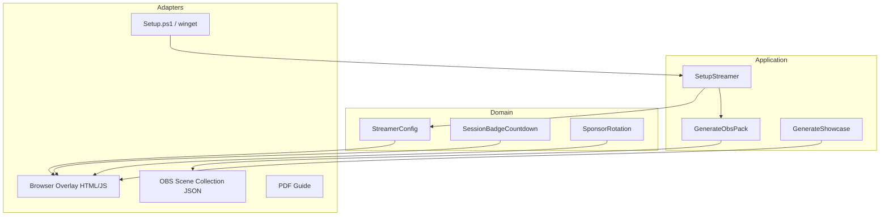

# Architecture

This pack is **files + OBS**, not a hosted product: streamer config and overlay behavior stay portable; Python tools generate scene JSON, showcase PNGs, and the Windows install path at the edges.

## Intent

Keep **domain/config** free of OBS/file IO where practical; put generation and install at the edges. Overlays are the “UI adapter” for the stream.



## Layers

| Layer | Location | May depend on |
|-------|----------|----------------|
| Domain ideas | `overlays/config.js` shape, docs/CONCEPTS | nothing external |
| Overlay UI | `overlays/*.html`, `*.js`, `assets/theme.css` | config only |
| Tools / use cases | `tools/*.py` | filesystem, Pillow, Chrome |
| Install adapter | `Setup.ps1`, `Setup.bat` | winget, Python, OBS AppData |
| OBS artifact | `obs/PiGreco_Racing.json` | generated, not hand-edited long-term |

## Rules

1. **Regenerate, don’t hand-edit** OBS JSON for layout math — change `tools/generate_pack.py`.
2. New on-stream widgets = new small JS module + CSS in theme + config keys.
3. Official logos live under `overlays/assets/official/`; processed copies in `overlays/assets/`.
4. Telemetry (Phase 3) must enter via a **port** (local WebSocket / JSON file) — never hardcode a sim SDK inside HTML. Contract + mock + iRacing bridge live in `adapters/telemetry/` (ADR-005, P3-02).

## Folders

```
adapters/
  telemetry/          # CONTRACT.md + mock_server.py + iracing_bridge.py + domain_standings.py
  streamelements/     # CSS/theme exports (planned)
  streamdeck/         # VirtualDeck / Stream Deck button maps (P2-03)
overlays/
  broadcast-chrome.html   # telecronaca UI (P3-02)
  modules/            # optional future home for JS modules
docs/
  TELEMETRY_BROADCAST.md
  workstreams/
  adr/
```

## OBS specifics

- Profile canvas **1920×1080**.
- Relative transforms required (OBS 32): see `pos_rel` helpers in `generate_pack.py`.
- Browser Sources use `file:///` URLs absolute to install path — regen after move.
